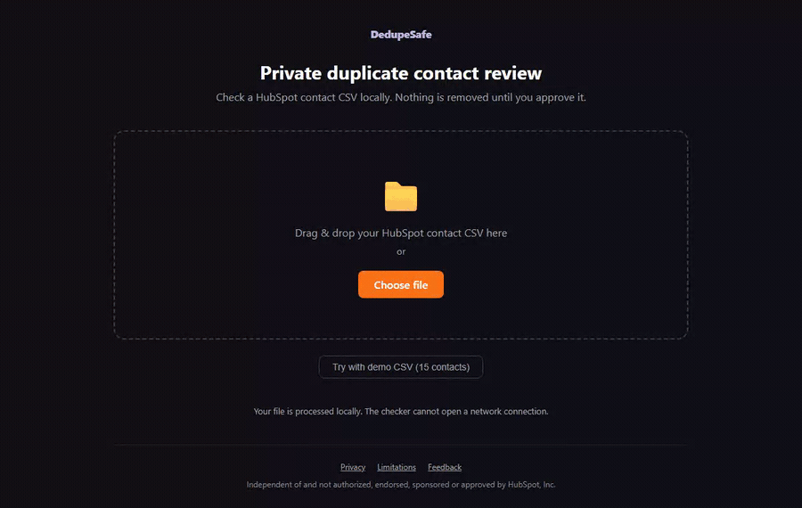

# DedupeSafe

DedupeSafe reviews likely duplicate contacts in a HubSpot CSV export. It runs
inside the browser, requires no account or API access, and removes no row until
the user approves a merge and confirms the final export.

Live site: https://dedupesafe.vercel.app



<sub>Recorded from the checked-in 15-row demo with `npm run demo`.</sub>

## Where it fits

HubSpot automatically deduplicates new contacts by exact email across plans.
HubSpot's duplicate manager compares several contact properties, but requires a
Professional or Enterprise subscription. DedupeSafe provides a local CSV review
step for Free and Starter teams and for consultants who do not want portal
access during an initial audit.

Current HubSpot documentation:

- https://knowledge.hubspot.com/records/deduplication-of-records
- https://knowledge.hubspot.com/records/manage-duplicate-records

## Safety model

- Every candidate group starts as **unreviewed** and stays unchanged.
- **Merge these** approves one group for collapse.
- **Keep both** preserves every row in that group.
- The final export requires a separate confirmation checkbox.
- A second download records every group, row, confidence label and decision in
  an audit CSV.
- The original file is never modified.

The export keeps the most complete row in each approved group. It does not merge
missing values into that row. The review screen and audit report list values to
copy before importing the result.

## Privacy

The checker has no backend, database, account or analytics script. It makes no
runtime network requests. Its Content Security Policy includes
`connect-src 'none'`, which blocks fetch, XHR, WebSocket and beacon connections.

The marketing pages are a separate case. They count visits with Vercel Web
Analytics, served from the site's own origin, and their policy allows
`connect-src 'self'` for that single purpose. No page count can contain the CSV,
contact count, mapping, match results or export decisions. See
[measurement](docs/MEASUREMENT.md) and [privacy](public/privacy/index.html).

## Matching rules

Automatic candidates require a shared identifier:

| Identifier | Maximum confidence |
| --- | ---: |
| identical email or `+tag` variant | 100% |
| identical phone or matching long suffix | 100% |
| compatible same-domain email local parts | 95% |
| same handle across providers, with another agreeing field | 85% |

Names and companies can strengthen an identifier. They cannot create an
automatic candidate on their own. A separate review tier surfaces selected
name variants when surname and employer or email domain agree.

The matcher rejects a pair when both rows contain clearly different surnames,
even if they share an inbox or switchboard number. This prevents a sparse row
from joining two people through transitive grouping. The one exception is an
identical private address on both rows: a surname that changed between exports
still belongs to one mailbox. Role addresses such as `info@` and
`sales.team@` keep the surname rule.

Names are compared with diacritics folded, so "Öztürk" and "Ozturk" are one
surname on both the review and the conflict path. Employer comparison ignores
punctuation and legal suffixes, so "Acme Inc" and "Acme, Inc." are one
employer.

## Development

Requires Node.js 24.

```bash
npm install
npm run dev
```

| Command | Purpose |
| --- | --- |
| `npm test` | Unit and demo regression tests |
| `npm run test:e2e` | Chromium launch flow, worker scan and downloads |
| `npm run lint` | Oxlint |
| `npm run build` | TypeScript and production Vite build |
| `npm run benchmark` | Deterministic 10k and 50k matching runs |
| `npm run demo` | Re-records `docs/demo.gif` (needs a dev server and ffmpeg) |
| `npm audit --audit-level=high` | Dependency audit |

The CI workflow runs every command above.

## Project structure

```text
index.html                 static marketing page
app/index.html             checker entry point
public/privacy/            privacy note
public/limitations/        product limitations
src/App.tsx                upload, mapping, review and export flow
src/core/csv.ts            CSV parsing and column mapping
src/core/matcher.ts        blocking, scoring and grouping
src/core/export.ts         reviewed CSV and audit report
src/core/scan.worker.ts    cancellable browser worker
tests/                     unit, regression and browser tests
scripts/benchmark.ts       repeatable performance harness
scripts/capture-demo.ts    records the demo GIF
```

## Evidence and limitations

The checked-in demo contains 15 rows with six identifier-based duplicate groups
and one name-only review group. A regression test verifies the complete path.

`benchmarks/latest.json` records performance from the machine that last ran the
benchmark. It does not promise the same timing on every browser or device.

No real or safely anonymized labeled contact corpus is checked in. Do not claim
a precision, recall or accuracy rate until an authorized evaluation is complete.
See [evaluation](docs/EVALUATION.md) and [known limitations](public/limitations/index.html).

## Feedback

Use [GitHub Issues](https://github.com/Eyyupisakarakasli/dedupesafe/issues)
with invented sample rows. Never attach a contact export or personal data.

## Trademark notice

HubSpot is a trademark of HubSpot, Inc. DedupeSafe is independent of HubSpot,
Inc. and is not authorized, endorsed, sponsored, affiliated with or otherwise
approved by HubSpot, Inc. See the [brand decision](docs/BRAND-AND-DOMAIN.md).

## License

[MIT](LICENSE) © Eyyüp İsa Karakaşlı
